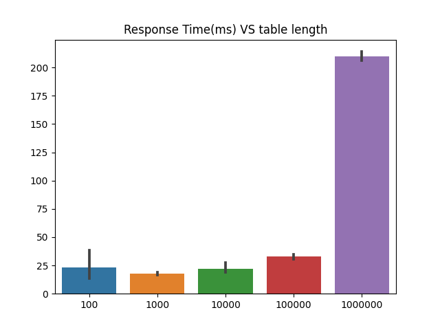
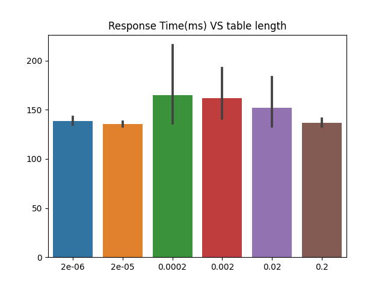
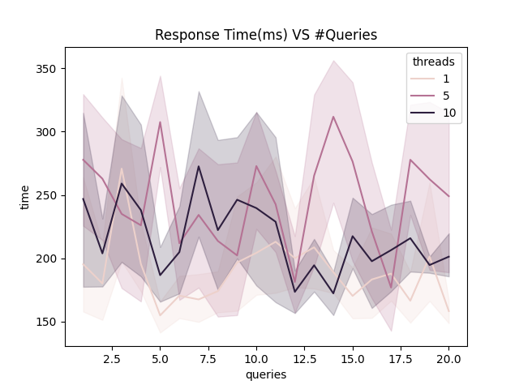
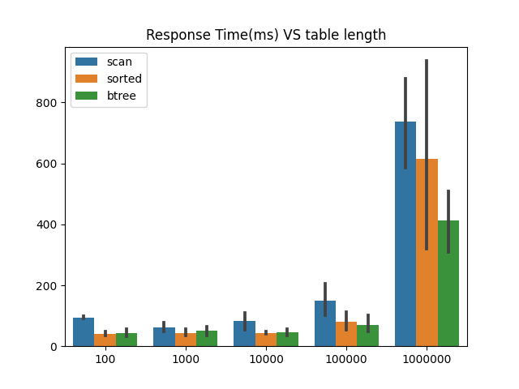
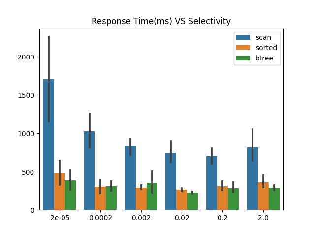
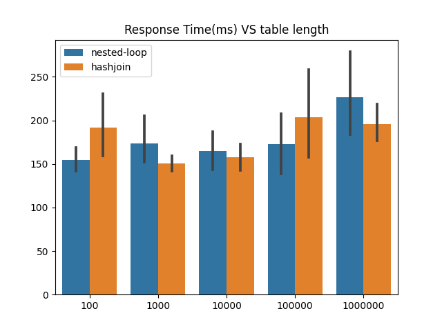
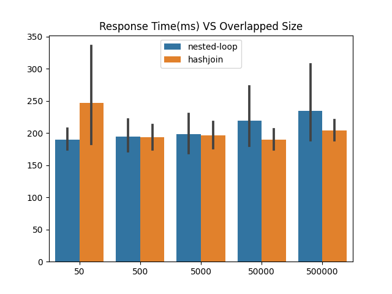

# Testing Infrastructure

- Testing scripts and data: `benchmarktest` directory

- Run all the tests: `benchmarktest/alltest.sh`

- Generate data and dsl scripts: `benchmarktest/datagen.py`

# Milestone 1

*CS165 Fall 2021*

***Yuanbiao Wang***

## Introduction

I plan to develop a basic data system that supports almost every of the elementary operations that is defined in the course requirement. The most important part about milestone1 is the storage and query system, especially the data layout is the core.

I chose column-store layout as it is efficient for large batches of select request. As of data persistent and reading, I used the `mmap` function to map the disk storage file. To realize successing select request, we have to save the select result for one column, which should be close to a proper column, so I used a union of column and select result for this specific data structure.

## Problems Tackled

- **[Client Context]** How do we parse the intermediate variable name assigned by the client?
- **[Lazy Load]** We don't want to keep all the columns in the RAM. How can we load them only when needed?
- **[Adjustable tables]** To save memory and storage cost, can we find a way to dynamically decide the length of the table?

## Technical Description

#### Client Context

1. Problem framing: we need to find what's the intermediate result for selected indices and fetched vectors.
2. High-level solutions: we keep track of all the selected indices and fetched results in the RAM so that we can search by the name when we need to print the result
3. Technical details: for `print` command, columns and fetched results are equivalent. But they are different with regard to the data retrieval. So I use a union structure to store the both the fetched result and columns.

#### Lazy Load

1. Problem framing: loading all the data into the RAM once the machine initiated is too costly.
2. High-level solutions: we first set the column data to be null pointer. Only when it's requested by a `select` or `print` command we will load the column from the disk.
3. Technical details: whenever we are retrieving data from the column pointer, we first check if it's a null pointer. If so, we call the relevant function to read the data from the disk.

#### Adjustable Table

1. Problem framing: table size should be adjustable to deal with scalable data.
2. High-level solution: refer to the solution of `std::vector`, we double the size of the array once it's full.
3. Technical Details: we have to take care of memory allocation and deallocation to avoid memory leakage.   Specifically, we have to first allocate a new chunk of memory for the double-sized array, do the copy and then deallocate the old array memory.

## Testing

Specifically, I am running 2 experiments for this milestone. To perform these tests, I used a python script (`benchmarktest/datagen.py`) to generate arrays of different lengths and selectivities to csv files.

I then wrote a shell script (`benchmarktest/runm1.sh`) to automate the test and output the response time in miliseconds.

1. **Testing how the number of rows affects the response time**

   I have tested arrays of length 100, 1000, and up to 1000000. For each array, the data would be repetitions from 0 to 99, but shuffled. For examples, the array of length 1000 would be 10 repetitions of 0 to 99. The select query would be find all the numbers less than 20 and output the average.

   In this way, the aggregation and output cost of all these queries are the same, so the comparison would simply be the scan. Each experiments are repeated 5 times to compute mean and confidence interval. The results are demonstrated in the following figure:

   

   From the graph we can see that the basic trend is the response time increases as the data scales go bigger, and the response time should be approximately linear to the data scale. In this graph, we should observe a logarithm-like pattern, which is the fact. You can note a huge increase when the data scales from 100000 to 1000000.

2. **Testing how the selectivity affect the response time**

   Theoretically, due to the branch-prediction algorithm, the scan should have lower response time when the selectivity is low or very high, but have the longest response time when selectivity is in the middle, around 50%, would that be the case? I tested the same array with 1000000 elements, but with different select queries that is of different selectivity: from 2e-6 up to 0.2. The result is plotted as follows:

   

   The graph does look very much like the shape, indicating that the theory is correct.

# Milestone 2

*CS165 Fall 2021*

***Yuanbiao Wang***

## Introduction

On the basis of milestone1, I decided to add a new functionality to process with batches of select request. If several select requests are to be operated on the same column, we will utilize the multithread mechanism to process them in parallel.

## Problems to Tacle

- **[Thread pool]** creating new threads is very costly, we need a data structure to dispatch tasks for all threads.
- **[When for parallelization]** how do we decide whether two tasks should be executed in parallel?

## Technical Description

#### Thread pool

1. Problem framing: we need to create a data structure for the queueing and dispatch of the tasks, as well as the creation and deletion of threads.
2. High-level solutions: we maintain a certain number of threads with producer-consumer mode. Whenever new tasks come, they are put into a queue, and if one thread in the thread pool is available, it will be utilized to execute the head task of the queue, elsewise the tasks will be waiting.
3. Technical details: We need to use a mutex lock to avoid conflicts between threads; when the queue is empty, we need to keep the threads sleeping to reduce resource cost. When there is a coming task, we need to send a condition signal to the thread pool to wake up and start to process this task.

#### When for parallelization & Locality

1. Problem framing: Do we divide on column query with several segments or do we run multiple select queries in parallel? We need to take care of locality to make sure our program is cache-friendly but in the mean time keep the code simple.
2. High-level solutions: I choose the second one. As the length of the column data array is mutable, it is hard to ensure the efficiency of parallelized scan by segmenting the column. While running several queries together is easier to implement and can be guaranteed to improve the performance when there are a batch of coming select queries.
3. Technical details: After we parse the command, we just throw them all in the queue. To achieve locality, we want to make sure that scans over the same column will be run together. To achieve this, instead of traditional FIFO queue structure, we are inserting the coming query into the correct position to keep the queue sorted by column names.

## Testing

**Testing how the number of queries and number of threads affects the response time**

I have tested with arrays of length 1000000 and a batch of queries containing 1 up to 20 queries. For the number of created threads, I chose 3 representative count: 1, 5 and 10. I repeated every experiments for 5 times and plot the confidence. The result is as follows:

From the graph we can see, contrary to our expectation, with only one thread, the program actually runs the fastest, while 10 threads are faster than 5 threads. This is possibly because:

1. Multithreading brings extra cost to maintain the worker queue
2. Multithreading is different from multi-process, when they access resources they may also have to wait.

All the 3 settings show good robustness w.r.t the number of queries.

# Milestone 3

*CS165 Fall 2021*

***Yuanbiao Wang***

## Introduction

I decided to add support for index in this part. Specifically, I have implemented clustered and unclustered index, and each of the index supports btree or simple binary search query.

## Problems Tackled

- **[Sort with a copy]** How do we make sure we are not messing with the order of the other columns for unclustered index, and how do we sort all the other columns using a clustered index?
- **[BTree and range query]** The fully-functional B+ tree is too complicated for this problem(at least for me), how do we simplify it to adapt to the range query?
- **[Index persistence and restore]** We need to persist the indexing as well as the column

## Technical Description

#### Sort with a copy

1. Problem framing: for clustered index, we need to figure out a way to efficiently sort other columns all along; for unclustered index, we need to keep a copy of the sorted result without damaging other columns.
2. High-level solutions: We sort an index array together with the data array.
3. Technical details: for clustered index, I initialize the index array to be 0..n-1, where n is the number of the elements. I am using quicksort in this problem, so whenever there is a swap in the quicksort algorithm, I would also perform a swap on the index array. Then I will use this index array to reorder other columns; for unclustered index, I saved a copy of the data array, and sort the array, again, with the index array initialized to be 0..n-1, and I will save the reordered index array to keep track of the sorted copy, instead of saving the sorted data itself. (the merit of such implementation is that it is very convenient the fetch)

#### BTree and Range Query

1. Problem framing: The complete version of B+ tree is very costly as of programming, and is not suitable for range query.

2. High-level solutions: I did not implement the dynamic update of the tree, and I also modify the definition of point query to better support range query with duplicated keys.

3. Technical details: First of all, the BTree is built bottom-up. After getting the key(the data) and the value(the index) array, I will combine them together as a struct array to bind the key-value pairs. Next, I will divide them equally by length, and build tree structure bottom-up layer-by-layer ensuring a fixed fanout. The query also is slightly different, instead of finding the exact same key, we are finding the least key that is greater than the query key. Each time we will traverse the internal node, and find the last dividing number that is no greater than the key, and traverse that node recursively. When we reach the leaf node, to avoid any kind of complexity, I did not dig into the details, instead, I just traverse the leaf node(or its next) until I found a node with greater key than the query.

   Now let's think about range query. To retrieve a range from a sorted array, you actually have to traverse this range. So in reality all you have to do is to decide on the leftmost boundary and keeps traversing until the condition is not satisfied. In BTree indexing I defined the "find-leftmost" operation above. For binary search,  we need to include the boundary in case we are looking into the left partition.

#### Index persistence and restore

1. Problem framing: we need store and load the index
2. High-level solution: save them as is described in column store
3. Technical Details: We can actually adopt the same interface as the column data store. Since I have already abstracted them as individual functions only concerning a chunk of array, everything is fine here.

## Testing

1. **Testing how the number of rows affects the response time**

   I have tested arrays of length 100, 1000, and up to 1000000. For each array, the data would be the permutation of 1 to n, where n is the number of elements. The select query would be find all the numbers less than 0.2n

   Each experiments are repeated 5 times to compute mean and confidence interval. The results are demonstrated in the following figure:

   

   From the graph we can see that the result is aligned with our expectation. BTree indexing would be most friendly to queries, and the second best is the binary search, and the worst would be the scan; this can be concluded from their complexity. Another thing to notice is that binary search has a very prominent variance, which might cause it to be even slower than scanning when the number of elements is huge. However, BTree is very stable in terms of performance.

   

2. **Testing how the selectivity affect the response time**

   In this experiment, we fixed the number of elements to be 1000000, but we perform queries with different selectivity. We have seen before that the curve of scan w.r.t selectivity would be somehow bell-shaped, meaning either large or small selectivity is good for the performance. How about binary search and BTree?

   

   Again, this graph has proved that under every circumstances Btree is better than binary search and then on a huge edge over simple scan, and both of them is very robust to the change of selectivity, which is a good feature.

   However, the response time for scan is now a reverse bell shape, with which I am quite confused. 

# Milestone 4

*CS165 Fall 2021*

***Yuanbiao Wang***

## Introduction

I added support for a very simple two-way join to my database system. I did not implement grace hash join; Instead, I implemented simple hash join

## Problems Tackled

- **[Hash table]** How do implement an efficient hash table without errors and how to perform join with it?
- **[Which one should be on the outer?]** Which array should be on the outer loop? The larger one or the smaller one?

## Technical Description

#### Hash table

1. Problem framing: How do implement an efficient hash table without errors and how to perform join with it?
2. High-level solutions: Hash table with linked list
3. Technical details: Based on the idea of object-oriented programming(OOP) and my past experience of debugging endless memory errors, I decided to implement a bug-free linked-list first, and based on the linked-list(which contains a fat-node setting, by the way, to optimize the data movement process), and then implement a hash table with the help of it. When it comes to join, I built a hash table for the smaller array, and query each element in the larger array from the hash table to see if it exists in the smaller array. 

#### Which one should be on the outer

1. Problem framing: Which array should be on the outer loop? The larger one or the smaller one? 
2. High-level solutions: The smaller one should be kept in the outer loop, basically
3. Technical details: For the nested-loop join, the most ideal way is that the smaller array can fit in the cache, and we only need to rotate elements from the larger array. In this way, the data movement is minimized. However, I noted that the output need to be kept in the original error, so I did some swaps before and after the join. Also for the hash join I used the smaller array to build the hash table.

## Testing

1. **Testing how the number of rows affects the response time**

   I have tested arrays of length 100, 1000, and up to 1000000. For the first column, the data would be permutations of 1 to n, where n is the number of elements, and for the second column, the data would be the permutation of n/2 to 3/2n, so they will have an overlap of n/2. 

   Each experiments are repeated 5 times to compute mean and confidence interval. The results are demonstrated in the following figure:

   

   From the graph we can see that hash join is superior to the nested-loop join as the data gets very large(1000000); but with very small data, the nested-loop join is better. 

   

2. **Testing how the overlap size affect the response time**

   In this experiment, we fixed the number of elements to be 1000000, and tested the "**overlap size**" of the two arrays. Specifically, suppose the range for the first array is 200000, we will shift the start of the range for the second array's query from 0 to 200000 to observe the change of response time for the join operation. I demonstrated my result in the following graph

   

   As is shown, hash join would become better as the overlap size increases. If overlap size is very small, the nested-loop join would even be better.

